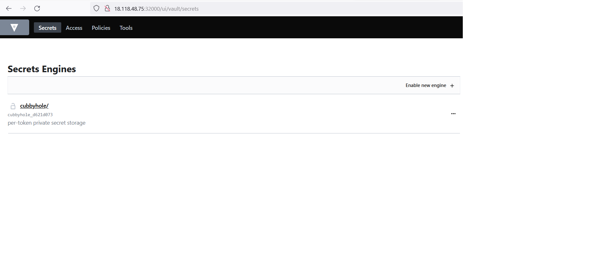

# hashicorp-vault

| ID | Topic | Remarks |
| ----------- | ----------- | ----------- |
| A | [Install Vault](#a-install-vault) |  Installing Vault via Helm Chart ||
| B | [Understand the setup](#b-understand-the-setup) |  Vault and Vault Injector ||
| C | [Initialize Vault](#c-initialize-vault) |  Initialize Vault ||
| D | [Unseal Vault](#d-unseal-vault) | Unseal Vault ||
| E | [Vault UI](#e-vault-ui) | Vault UI|
| F | [Vault Secret Engine](#f-vault-secret-engine) | Vault Secret Engine Key Value |
| G | [Vault Policy - Authorization](#g-vault-policy) | Policies|
| H | [Vault Authentication - Userpass](#h-vault-authentication---userpass) | Vault Auth Userpass|
| I | [Vault Authentication - Kubernetes](#i-vault-authentication---kubernetes) | Vault Auth Kubernetes|


## A. Install Vault

```
ubuntu@ip-172-31-22-219:~/linux-amd64$ helm version
version.BuildInfo{Version:"v3.8.0", GitCommit:"d14138609b01886f544b2025f5000351c9eb092e", GitTreeState:"clean", GoVersion:"go1.17.5"}

ubuntu@ip-172-31-22-219:~/linux-amd64$ helm repo add hashicorp https://helm.releases.hashicorp.com
"hashicorp" has been added to your repositories

ubuntu@ip-172-31-22-219:~/linux-amd64$ helm repo list | grep -i hashicorp
hashicorp       https://helm.releases.hashicorp.com

ubuntu@ip-172-31-22-219:~/linux-amd64$ helm repo update
Hang tight while we grab the latest from your chart repositories...
...Successfully got an update from the "hashicorp" chart repository
Update Complete. ⎈Happy Helming!⎈

ubuntu@ip-172-31-22-219:~/linux-amd64$ helm install vault hashicorp/vault
NAME: vault
LAST DEPLOYED: Sat Feb 26 18:10:38 2022
NAMESPACE: default
STATUS: deployed
REVISION: 1
NOTES:
Thank you for installing HashiCorp Vault!

Now that you have deployed Vault, you should look over the docs on using
Vault with Kubernetes available here:

https://www.vaultproject.io/docs/


Your release is named vault. To learn more about the release, try:

$ helm status vault


ubuntu@ip-172-31-22-219:~$ helm status vault
NAME: vault
LAST DEPLOYED: Sat Feb 26 18:10:38 2022
NAMESPACE: default
STATUS: deployed
REVISION: 1
NOTES:
Thank you for installing HashiCorp Vault!

ubuntu@ip-172-31-22-219:~$ kubectl exec -it vault-0 -- /bin/sh
/ $ vault status
Key                Value
---                -----
Seal Type          shamir
Initialized        false
Sealed             true
Total Shares       0
Threshold          0
Unseal Progress    0/0
Unseal Nonce       n/a
Version            1.9.2
Storage Type       file
HA Enabled         false


ubuntu@ip-172-31-22-219:~$ kubectl get pods  | grep -i vault
vault-0                                  1/1     Running   0          16h
vault-agent-injector-58b6d499-c2qqk      1/1     Running   0          16h

$ helm get manifest vault

```

## B. Understand the setup 
---

## B.01. vault-agent-injector-cfg 
---

The configuration of the MutatingWebhookConfiguration tells - the admission controller will try to mutate any POD kubernetes resources for CREATE and UPDATE operations. Then to Mutate - it will consult the web hook - which is running as a service vault-agent-injector-svc. Agent injector is a kubernetes Mutating Admission Webhook. This controller intercepts pod CREATE and UPDATE requests looking for the metadata annotation vault.hashicorp.com/agent-inject: true in the requests. When found, the controller will inject the init container and the sidecar container. The init container is to pre-populate our secret, and the sidecar container is to keep that secret data in sync throughout our application's life cycle.

```
ubuntu@ip-172-31-22-219:~$ kubectl get MutatingWebhookConfiguration
NAME                       WEBHOOKS   AGE
vault-agent-injector-cfg   1          28d

ubuntu@ip-172-31-22-219:~$ kubectl  describe MutatingWebhookConfiguration vault-agent-injector-cfg

Webhooks:
  Admission Review Versions:
    v1beta1
    v1
  Client Config:
    Ca Bundle:  URS0tLS0tCg==
    Service:
      Name:        vault-agent-injector-svc
      Namespace:   default
      Path:        /mutate
      Port:        443
  Failure Policy:  Ignore
  Match Policy:    Equivalent
  Name:            vault.hashicorp.com
  Namespace Selector:
  Object Selector:
  Reinvocation Policy:  Never

 Rules:
    API Groups:

    API Versions:
      v1
    Operations:
      CREATE
      UPDATE
    Resources:
      pods
    Scope:          *
  Side Effects:     None
  Timeout Seconds:  10
  
```

The webhook runs as a separate service

```
ubuntu@ip-172-31-22-219:~$ kubectl get svc vault-agent-injector-svc
NAME                       TYPE        CLUSTER-IP     EXTERNAL-IP   PORT(S)   AGE
vault-agent-injector-svc   ClusterIP   10.*.*.*   <none>        443/TCP   28d
```

## B.02. vault service
---

```
ubuntu@ip-172-31-22-219:~$ kubectl get svc vault
NAME    TYPE        CLUSTER-IP      EXTERNAL-IP   PORT(S)             AGE
vault   ClusterIP   10.*.*.*   <none>        8200/TCP,8201/TCP   28d

```


## C. Initialize Vault

```
 $ vault operator init
Unseal Key 1: lUn4Hzzd55/Mv4
Unseal Key 2: 8Taq0owMgshA
Unseal Key 3: /zELQkx3H0c+lz
Unseal Key 4: tERO9r22TnJzraIqHR
Unseal Key 5: AFuTli

Initial Root Token: s.JIQdpxqrRsM

Vault initialized with 5 key shares and a key threshold of 3. Please securely
distribute the key shares printed above. When the Vault is re-sealed,
restarted, or stopped, you must supply at least 3 of these keys to unseal it
before it can start servicing requests.

Vault does not store the generated master key. Without at least 3 keys to
reconstruct the master key, Vault will remain permanently sealed!

It is possible to generate new unseal keys, provided you have a quorum of
existing unseal keys shares. See "vault operator rekey" for more information.

/ $ vault status
Key                Value
---                -----
Seal Type          shamir
Initialized        true
Sealed             true
Total Shares       5
Threshold          3
Unseal Progress    0/3
Unseal Nonce       n/a
Version            1.9.2
Storage Type       file
HA Enabled         false


```


## D. Unseal Vault

```


/ $ vault operator unseal
Unseal Key (will be hidden):
Key                Value
---                -----
Seal Type          shamir
Initialized        true
Sealed             true
Total Shares       5
Threshold          3
Unseal Progress    1/3
Unseal Nonce       d1c1f3f93668b4e
Version            1.9.2
Storage Type       file
HA Enabled         false
/ $ vault operator unseal
Unseal Key (will be hidden):
Key                Value
---                -----
Seal Type          shamir
Initialized        true
Sealed             true
Total Shares       5
Threshold          3
Unseal Progress    2/3
Unseal Nonce       d1c1f0d93668b4e
Version            1.9.2
Storage Type       file
HA Enabled         false
/ $ vault operator unseal
Unseal Key (will be hidden):
Key             Value
---             -----
Seal Type       shamir
Initialized     true
Sealed          false
Total Shares    5
Threshold       3
Version         1.9.2
Storage Type    file
Cluster Name    vault-cluster-588ec97b
Cluster ID      c8fb7404-a581-65c7-d6b6-1e11e005f0b1
HA Enabled      false

```

## E. Vault UI
---

Services in Kubernetes are the objects that pods use to communicate with each other. ClusterIP type services are usually used for inter-pod communication.

There are two types of ClusterIP services, Headless Services & Services. Normal Kubernetes services act as load balancers and follow round-robin logic to distribute loads. 
Headless services don’t act like load balancers.Also, normal services are assigned IPs by Kubernetes whereas Headless services are not. Vault exposes its UI at port 8200. We will use a non-headless service of type NodePort as we want to access this endpoint from outside Kubernetes Cluster.

Create a node port type service on top of vault service.

```
ubuntu@ip-172-31-22-219:~$ cat vaultNodeport.yaml
apiVersion: v1
kind: Service
metadata:
  annotations:
    meta.helm.sh/release-name: vault
    meta.helm.sh/release-namespace: default
  creationTimestamp: "2022-02-26T18:10:44Z"
  labels:
    app.kubernetes.io/instance: vault
    app.kubernetes.io/managed-by: Helm
    app.kubernetes.io/name: vault
    helm.sh/chart: vault-0.19.0
  name: vault
  namespace: default
  resourceVersion: "7694312"
  uid: 66a46f29-e189-4c23-8d6c-5926854800ff
spec:
  type: NodePort
  publishNotReadyAddresses: true
  ports:
    - name: http
      port: 8200
      targetPort: 8200
      nodePort: 32000
    - name: https-internal
      port: 8201
      targetPort: 8201
  selector:
    app.kubernetes.io/instance: vault
    app.kubernetes.io/name: vault
    component: server
  sessionAffinity: None


```
and then access the UI - http://x.y.z.a:32000/ui/vault/secrets and you can initially login with root token created. 


## F. Vault Secret Engine
---

```
/ $ vault login
Token (will be hidden):
Success! You are now authenticated. The token information displayed below
is already stored in the token helper. You do NOT need to run "vault login"
again. Future Vault requests will automatically use this token.

Key                  Value
---                  -----
token                s.gggg
token_accessor       fff
token_duration       ∞
token_renewable      false
token_policies       ["root"]
identity_policies    []
policies             ["root"]

$ vault secrets enable -path=kv-v2 kv-v2
Success! Enabled the kv-v2 secrets engine at: kv-v2/

 $ vault secrets list
Path          Type         Accessor              Description
----          ----         --------              -----------
cubbyhole/    cubbyhole    cubbyhole_d621d073    per-token private secret storage
identity/     identity     identity_099eb58f     identity store
kv-v2/        kv           kv_29f574ed           n/a
sys/          system       system_1353b5c2       system endpoints used for control, policy and debugging

$ vault kv put kv-v2/database/config username=postgres password=pass123
Key                Value
---                -----
created_time       2022-03-29T17:57:27.526380746Z
custom_metadata    <nil>
deletion_time      n/a
destroyed          false
version            1

$vault kv get kv-v2/database/config
======= Metadata =======
Key                Value
---                -----
created_time       2022-03-29T17:57:35.985186799Z
custom_metadata    <nil>
deletion_time      n/a
destroyed          false
version            2

====== Data ======
Key         Value
---         -----
password    pass123
username    postgres

```
## G. Vault Policy 
---

```
/ $ vault policy write demo-policy - <<EOF
> path "kv-v2/data/database/config" {
>   capabilities = ["read"]
> }
> EOF
Success! Uploaded policy: demo-policy


/ $ vault policy read demo-policy
path "kv-v2/data/database/config" {
  capabilities = ["read"]
}


```

## H. Vault Authentication - Userpass 
---

```
/ $ vault auth enable userpass
Success! Enabled userpass auth method at: userpass/
/ $ vault write auth/userpass/users/batul \
>     password=foo \
>     policies=demo-policy
Success! Data written to: auth/userpass/users/batul

$ vault login -method=userpass username=batul password=foo
Success! You are now authenticated. The token information displayed below
is already stored in the token helper. You do NOT need to run "vault login"
again. Future Vault requests will automatically use this token.

Key                    Value
---                    -----
token                  s.rihqrQoSE7xn3JTME7UEgzpd
token_accessor         taF8l3FtMRhkw0OnLPkSBQa1
token_duration         768h
token_renewable        true
token_policies         ["default" "demo-policy"]
identity_policies      []
policies               ["default" "demo-policy"]
token_meta_username    batul

/ $ vault kv get kv-v2/database/config
======= Metadata =======
Key                Value
---                -----
created_time       2022-03-29T17:57:35.985186799Z
custom_metadata    <nil>
deletion_time      n/a
destroyed          false
version            2

====== Data ======
Key         Value
---         -----
password    pass123
username    postgres


```

## I. Vault Authentication - Kubernetes  
---

```
/ $ vault auth enable kubernetes
Success! Enabled kubernetes auth method at: kubernetes/
/ $  vault auth list
Path           Type          Accessor                    Description
----           ----          --------                    -----------
kubernetes/    kubernetes    auth_kubernetes_97bea6af    n/a
token/         token         auth_token_0a3d32a7         token based credentials
userpass/      userpass      auth_userpass_4adb1674      n/a


```

```
/ $ vault write auth/kubernetes/config token_reviewer_jwt="$(cat /var/run/secrets/kubernetes.io/serviceaccount/token)" kubernetes_host=https://${KUBERNETES_PORT_443_TCP_ADDR}:443 kubernetes
_ca_cert=@/var/run/secrets/kubernetes.io/serviceaccount/ca.crt

Success! Data written to: auth/kubernetes/config


```

```
/ $ vault write auth/kubernetes/role/demo-auth bound_service_account_names=demo-user bound_service_account_namespaces=default policies=demo-policy ttl=24h
Success! Data written to: auth/kubernetes/role/demo-auth

```
```
ubuntu@ip-172-31-22-219:~$ kubectl create serviceaccount demo-user
serviceaccount/demo-user created

ubuntu@ip-172-31-22-219:~$ cat demo-pod.yaml
apiVersion: v1
kind: Pod
metadata:
  creationTimestamp: null
  labels:
    run: demo-pod
  name: demo-pod
spec:
  serviceAccountName: demo-user
  containers:
  - image: nginx
    name: demo-pod
    resources: {}
  dnsPolicy: ClusterFirst
  restartPolicy: Always
status: {}

```

```

/ $ vault write -tls-skip-verify auth/kubernetes/login jwt=eyJhbGciOiJSUzI1NiIsImtpZC role=demo-auth
Key                                       Value
---                                       -----
token                                     s.7wG5bH7ZUfO1zvKojdhdcpDS
token_accessor                            LcYsvaKc9itkbEbGK4IY8u4a
token_duration                            24h
token_renewable                           true
token_policies                            ["default" "demo-policy"]
identity_policies                         []
policies                                  ["default" "demo-policy"]
token_meta_role                           demo-auth
token_meta_service_account_name           demo-user
token_meta_service_account_namespace      default
token_meta_service_account_secret_name    n/a
token_meta_service_account_uid            f57f3842-85fe-44f1-9093-7f60915e8350

ubuntu@ip-172-31-22-219:~$ kubectl exec -it vault-0 -- /bin/sh
/ $ vault login
Token (will be hidden):
Success! You are now authenticated. The token information displayed below
is already stored in the token helper. You do NOT need to run "vault login"
again. Future Vault requests will automatically use this token.

Key                                       Value
---                                       -----
token                                     s.7ojdhdcpDS
token_accessor                            LcYsv8u4a
token_duration                            23h58m18s
token_renewable                           true
token_policies                            ["default" "demo-policy"]
identity_policies                         []
policies                                  ["default" "demo-policy"]
token_meta_service_account_uid            f57f3842-85fe-44f1-9093-7f60915e8350
token_meta_role                           demo-auth
token_meta_service_account_name           demo-user
token_meta_service_account_namespace      default
token_meta_service_account_secret_name    n/a

/ $ vault kv get kv-v2/database/config
======= Metadata =======
Key                Value
---                -----
created_time       2022-03-29T17:57:35.985186799Z
custom_metadata    <nil>
deletion_time      n/a
destroyed          false
version            2

====== Data ======
Key         Value
---         -----
password    pass123
username    postgres

```
